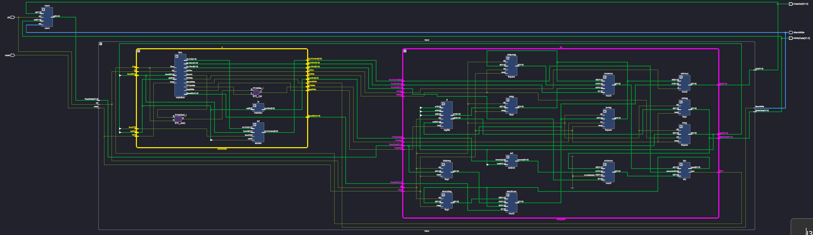
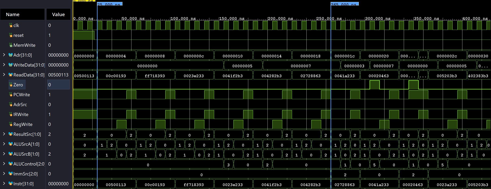
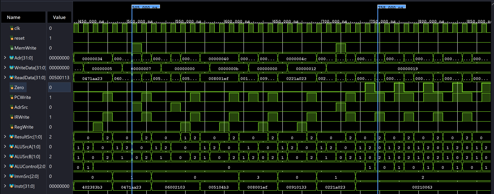

# Multicycle RISC-V Processor 🧠

This repository contains the hierarchical SystemVerilog implementation of a complete **Multicycle RISC-V Processor**, based on the microarchitecture detailed in *Harris & Harris: Digital Design and Computer Architecture (RISC-V Edition)*. The processor uses a unified instruction/data memory and supports the following RISC-V instructions: `addi`, `add`, `sub`, `and`, `or`, `slt`, `lw`, `sw`, `beq`, `jal`.

## 🏗️ Architecture Overview

The processor follows a multicycle design where each instruction is broken into discrete steps (Fetch, Decode, Execute, Memory, Writeback) executed across multiple clock cycles. A central FSM controls which step is active each cycle, enabling reuse of the same ALU and memory port for different operations.

The design is split into three main hierarchical modules:

1. **`top`** — Top-level wrapper containing the processor (`riscv`) and the unified memory (`mem`). The `riscv` and `mem` modules are defined in `top.sv`.
2. **`riscv`** — The processor itself, containing the controller and datapath.
   - **Controller** — Main FSM (11 states), ALU decoder, and instruction decoder.
   - **Datapath** — PC, register file, ALU, immediate extender, and pipeline registers (IR, A, WriteData, ALUOut, Data).
3. **`mem`** — Unified memory holding both instructions and data, initialized from `riscvtest.txt`.

## 📸 Design Images

### Processor Architecture

### Vivado Schematic

The generated Vivado schematic is available here: [schematic.pdf](schematic.pdf)

### Simulation Waveforms

The following waveforms show the processor running the full RISC-V test program across the first and second halves of the simulation.

## 🗂️ File Structure

| File | Description |
|---|---|
| `top.sv` | Top-level module: instantiates `riscv` and unified memory `mem`. |
| `controller.sv` | Controller: Main FSM, ALU decoder, and instruction decoder. |
| `datapath.sv` | Datapath: PC, register file, ALU, mux'es, and pipeline registers. |
| `blocks.sv` | Reusable building blocks: register file, ALU, immediate extender, flip-flops, mux'es. |
| `testbench.sv` | Top-level testbench. Verifies the full processor by running a test program and checking that `mem[100] = 25` is written. |
| `controller_testbench.sv` | Standalone controller testbench. Verifies all FSM states and control signals for every instruction type. |
| `riscvtest.txt` | Machine code of the test program (initial memory contents). |
| `archi.png` | Full processor architecture diagram. |
| `schematic.pdf` | Vivado-generated processor schematic. |
| `first_half.png`, `second_half.png` | Simulation waveform screenshots. |

## 🧪 Simulation & Testing

The design includes two independent testbenches:

### Top-level test (`testbench.sv`)
Runs a complete RISC-V program through the entire processor. The testbench reports `Simulation succeeded` when the processor correctly writes the value `25` to memory address `100`, which requires all instruction types to function correctly.

### Controller test (`controller_testbench.sv`)
Tests the controller in isolation. Drives every supported opcode and verifies that all FSM states emit the correct control signals (`ImmSrc`, `ALUSrcA`, `ALUSrcB`, `ResultSrc`, `AdrSrc`, `ALUControl`, `IRWrite`, `PCWrite`, `RegWrite`, `MemWrite`). All 24 test cases pass.

Both testbenches can be run on any standard SystemVerilog simulator (Vivado XSim, ModelSim, QuestaSim) by setting them as the top-level simulation module.

## 📋 Status

✅ All instructions execute correctly  
✅ Top-level testbench passes (`Simulation succeeded`)  
✅ Controller testbench passes (24/24 tests)  
✅ Synthesis runs cleanly in Vivado 2023.2
